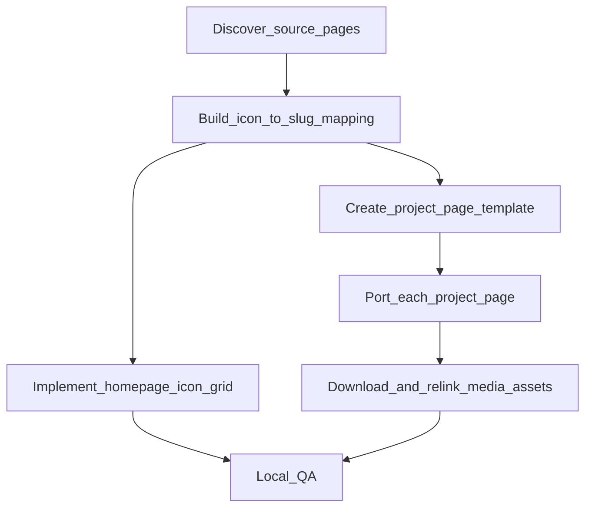

# Handiwork portfolio migration plan

## Goals

- Replace the current `handiwork` section in [`/Users/travis/repos/digital-garden/index.html`](/Users/travis/repos/digital-garden/index.html) with a **responsive grid of icons + captions**.
- Each icon links to a **standalone project page** at `portfolio/<slug>.html`.
- **Port project content mostly verbatim** from `travisreedmendoza.com`, and **self-host media** in this repo.
- Keep everything **lightweight, HTML-first, minimal JS**, inspired by `karpathy.ai`.

## Non-goals

- Introducing a framework or a build pipeline.
- Pixel-perfect cloning of `karpathy.ai` (we’ll borrow the vibe: clean typography, simple layout, dense content).

## Proposed information architecture

- Homepage: `index.html`
- Project pages: `portfolio/<slug>.html`
- Project media: `portfolio/assets/<slug>/...` (images, gifs, etc.)
- Icons (already): `portfolio/icons/*`

## Work breakdown

### 1) Inventory projects and establish canonical slugs/titles

- Use the existing filenames in `portfolio/icons/` as the initial project set:
  - `AstrobeeAndDock`, `AUV`, `carbowl`, `customer_success`, `Go2`, `IDGAF`, `mpc`, `T-shirts`, `tb3`, `Techshop`
- Discover the corresponding source pages on `travisreedmendoza.com` via sitemap / site-search.
- Produce a mapping table:
  - **icon file** → **new slug** → **display title** → **source URL**
- Quick approval checkpoint: you confirm/adjust any ambiguous ones (e.g., what `tb3`, `mpc`, `IDGAF` should be titled/slugged as).

### 2) Create a tiny “project page” template (consistent layout)

Create a shared structure we’ll copy into each page:

- Header: site title + back link (`Home`)
- H1: project title
- A compact “facts” block (dates, role, stack) if present on the old page
- Body: ported content sections (keep headings/bullets readable)
- Footer: back links + external links (GitHub, video, paper)

Files:

- `portfolio/_template.html` (optional helper file; not linked publicly)
- `portfolio/<slug>.html` for each project

### 3) Replace `handiwork` section on homepage with icon grid

In [`/Users/travis/repos/digital-garden/index.html`](/Users/travis/repos/digital-garden/index.html):

- Replace the current text-only `handiwork` paragraph with a `<section>` containing a grid of links.
- Each grid item:
  - `<a href="portfolio/<slug>.html">`
  - `">`
  - caption (project title)

### 4) Add minimal CSS for the grid + project pages

In [`/Users/travis/repos/digital-garden/style.css`](/Users/travis/repos/digital-garden/style.css):

- Add `.handiwork-grid` styles:
  - CSS grid with responsive columns (works down to mobile)
  - consistent icon sizing (`object-fit: cover`, subtle radius)
  - clear hover/focus states (underline caption or slight opacity)
- Add basic typography defaults to be more Karpathy-ish (still minimal):
  - sane line-height, link hover, maybe a soft max width already exists via `.container`

### 5) Port content + self-host media from travisreedmendoza.com

- For each project page:
  - Copy text/structure into `portfolio/<slug>.html`.
  - Download referenced media into `portfolio/assets/<slug>/...`.
  - Update `` to point to local assets.
  - Keep filenames stable and reasonably sized (optionally compress oversized images).

Notes:

- This step will require **network access** during implementation to fetch images (e.g. via `curl`).
- We’ll avoid bloating the repo by:
  - preferring `.jpg` for photos, `.png` for diagrams, and compressing where it’s obviously large
  - keeping only the media actually used on the page

### 6) QA pass (lightweight)

- Open pages locally (simple static server) and verify:
  - links work, images resolve, layout is responsive
  - no broken relative paths
  - basic accessibility: `alt` text, keyboard focus visible on links

## Execution flow (high-level)

## Files we expect to touch/add

- Edit: [`/Users/travis/repos/digital-garden/index.html`](/Users/travis/repos/digital-garden/index.html)
- Edit: [`/Users/travis/repos/digital-garden/style.css`](/Users/travis/repos/digital-garden/style.css)
- Add: `portfolio/<slug>.html` (one per project)
- Add: `portfolio/assets/<slug>/...` (media)
- Optional add: `portfolio/_template.html`

## Implementation todos

- `discover-source-pages`: Find each project’s source URL on travisreedmendoza.com (sitemap/site-search) and draft the icon→slug→title mapping.
- `homepage-handiwork-grid`: Replace homepage handiwork section with icon+caption grid linking to `portfolio/<slug>.html`.
- `css-grid-styles`: Add minimal CSS for the grid + hover/focus states, staying consistent with current styling.
- `project-page-template`: Create a simple reusable HTML structure for project pages.
- `migrate-project-pages`: Create each `portfolio/<slug>.html` and port content verbatim.
- `migrate-media-assets`: Download, store, and relink images/media under `portfolio/assets/<slug>/`.
- `qa-links-layout`: Spot-check responsiveness, paths, and basic accessibility across homepage + project pages.